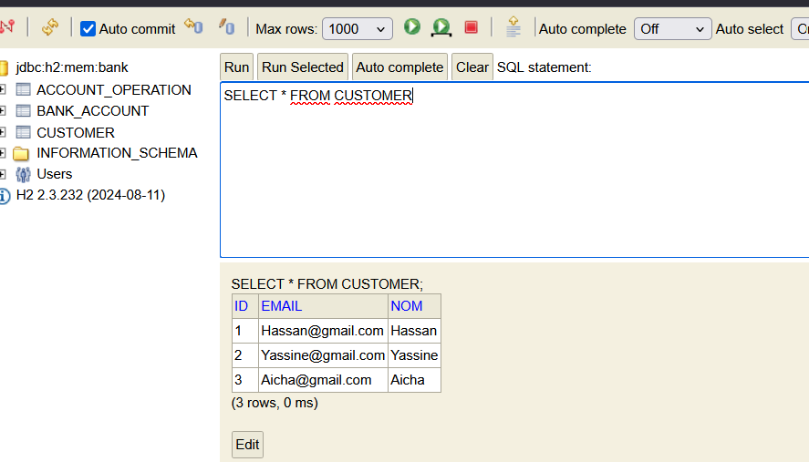

## Digital Banking

### Description du projet : 
On souhaite créer une application qui permet de gérer des comptes bancaires. chaque compte appartient à un client. 
Un compte peut subir plusieurs opérations de type DEBIT ou CREDIT. Il existe deux types de comptes : Comptes
courants et comptes épargnes.
 Le projet est composé de trois différentes parties qui sont : la partie Backend qui va être développée en utilisant 
 JEE Spring pour créer une API Restfull, une partie Frontend qui sera développé en utilisant ANGULAR et une dernière 
partie qui s'occupera de la sécurité le n l'application en gérant les authorisations et les authentifications. 

#### Partie 1 :Backend(Spring)
1. Créer un projet Spring Boot
2. Créer les entités JPA : Customer, BankAccount, Saving Account, CurrentAccount, AccountOperation
3. Créer les interfaces JPA Repository basées sur Spring Data
4. Tester la couche DAO
   5 Couche service, DTOs
6. RestController
7. Tester les web services Restful

#### Partie 2 : Frontend (Client Angular)

#### Partie 3 : (SpringSécurity)
Sécuriser l'application avec un système d'authentification basé sur Spring Security et Json Web Token

#### Les principales fonctionnalités
Ajouter des fonctionnalisés supplémentaires à votre projet comme :

- La gestion des clients (saisie, ajout, suppression, édition, recherche , etc.)
- La gestion des comptes (Ajout des comptes, recherche et administration des comptes)
- Pour chaque client, compte, opération enregistrée, il faut enregistrer avec l'enregistrement l'identifiant de l'utilisateur authentifié qui a effectué l'opération
- Gestion des comptes et des mot de passes des utilisateurs avec la possibilité qu'un utilisateur change son mot de passe
- Partie Dash Board : En utilisant ChartJS (ng-chart), créer la partie dashboard de l'application montrant des graphiques et des statistiques utiles pour les prises de décision
- Autres fonctionnalisés supplémentaires

#### Architecture du projet

#### Diagramme de classe

### Développement
 #### Partie 1:
1. Créer un projet Spring Boot

2. Création des entités JPA : Customer, BankAccount, Saving Account, CurrentAccount,
 
3. Créer les interfaces JPA Repository basées sur Spring Data

 

#### Nous aloons utiliser la strategy table_per_classe

4. 
4. 

